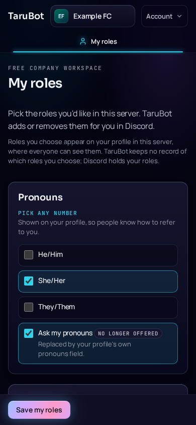
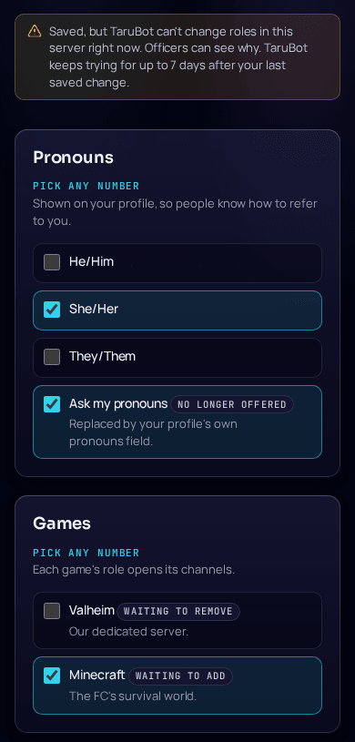

Your officers can offer roles you choose for yourself, such as pronouns, games or regions. You pick them on **My roles**, a page on your server's TaruBot website, and TaruBot adds or removes them for you in Discord. It replaces reaction roles: roles you already have show up on the page already ticked, however you got them.

:::note[Where to find it]
My roles needs a **2.40.0 or newer** TaruBot with its web pages turned on. Your officers can copy the page's link from their Role menu page; ask them for it if nobody has shared it.
:::

## Who can use it

- **Anyone with the server's Member or Guest role.** Guests can pick roles just like members.
- **Officers**, who can also see categories they haven't published yet.

Nobody else can sign in: someone still in the lobby, or who has lost Member and Guest, gets a page saying who the pages are for, and isn't signed in. If you've just been given Member or Guest, wait a minute and sign in again.

While TaruBot still has Discord's Administrator permission in the server, My roles is open to officers only. Your officers know how to fix that.

## Open My roles

1. **Open the link** your officers shared, or your TaruBot's web address.
2. **Sign in with Discord.** Signing in asks Discord only who you are: TaruBot can't read your messages, your other servers or your email, and it keeps no Discord token.
3. If My roles in one server is the only page open to you, you land straight on it. Otherwise choose your server, then **My roles**.

On a phone the page works the same way, and the **Save my roles** button stays at the bottom of the screen.

## Choose your roles

The page shows one card per category, in the order your officers set. Each card says how many roles you can pick:

- **Pick one**: the choices start with **No role from this category**. Choose it to drop the role you have.
- **Pick any number** or **Pick up to N**: tick as many as you like, up to the limit.

Each role has its name and, where your officers wrote one, a short description. Tick or untick what you want, then choose **Save my roles**.

**Only the categories you change are saved.** Leaving a category as it was never changes its roles, even if someone changed them in Discord after you opened the page.

### Things you might see

- **No longer offered** next to a role you have, or a category: officers stopped offering it. You can keep it, or untick it to remove it, but you can't pick it again once it's gone.
- **Can't be picked again right now** next to a role you have: it's still on the menu, but TaruBot can't give it to anyone at the moment. You can keep it, or untick it to remove it, but once it's gone you can't pick it again until your officers fix it.
- **A role you have that "can't be changed here right now"**, shown as a line of text instead of a choice: TaruBot can't safely change it at the moment, so it stays as it is. It still counts toward the category's limit, so in a **Pick one** category nothing is chosen for you. When such roles fill the category, its card says **Nothing to pick right now** and names them in one sentence ("You have @He/Him. It can't be changed here right now."), until they can be changed again.
- **"You have 2 of these roles. Pick one to keep it and remove the others."**: a pick-one category where you have several, for example from reaction roles. Nothing changes until you pick one.
- **"You have 4; the limit is now 3."**: officers lowered the limit after you picked. You can leave the category as it is; to change it, pick no more than the limit.
- **Waiting to add** or **Waiting to remove** next to a role: a change you saved hasn't been applied yet. While it waits, the ticks show your saved change, not your roles in Discord, and the label says which way each role will change. Notes about the limit then say what your saved change would leave you with.
- **"There are no roles to pick here right now."**: your officers offer roles, but none of them can be picked at the moment, for example while TaruBot can't change roles in the server. Ask an officer.
- **"Officers changed the roles on offer while you were choosing."**: the page shows what's on offer now. Check your choices and save again.
- **"Pick only one role here."** or **"Pick at most N roles here."** (the list at the top of the page names the category), a role that "can't be picked right now", or a role you have that "counts toward this category's limit": nothing was saved. Change that category, then save again.

## After you save

TaruBot changes your roles in Discord in the background, usually within a minute. The message at the top of the page says how your newest saved change is going. A message about a change that ended without being fully applied says when it ended, in UTC, and stays until you save another change, for up to 30 days:

| Message | What it means |
| --- | --- |
| "Saved. TaruBot is updating your roles in Discord." | It's on its way. Reload the page to check. |
| "Your roles were updated in Discord." | Done. This shows for 10 minutes after the change. |
| "Your roles were updated on (date), but N of your choices couldn't be applied…" | Some roles weren't available when TaruBot got to them, for example a role an officer changed in Discord. The rest were changed. Check your roles on the page, or ask an officer. |
| "TaruBot couldn't apply your last change on (date)." | None of the roles you picked was available when TaruBot got to them, so nothing changed. Check your roles on the page, pick again and save, or ask an officer. |
| "Saved. Role changes are paused in this server…" | TaruBot will apply your change when changes resume. You can't change your roles on the page until then. If the pause lasts more than 7 days, your change is dropped and you can pick again. |
| "Saved, but TaruBot can't change roles in this server right now." | Officers can see why. TaruBot keeps trying by itself for up to 7 days after your last saved change. |
| "TaruBot couldn't apply your last change…" | Check your roles on the page, pick again and save, or ask an officer. |
| "…within 7 days, so it was dropped on (date)." | Your change waited too long. Pick your roles again, then save. |
| "Nothing to save. Those are already your roles." | Nothing you picked was different, so nothing was saved. |
| "Nothing new to save." | A change you saved earlier is still waiting, and you didn't change anything else, so nothing was saved. The waiting change carries on as the message under it says. |

Saving again before TaruBot has finished is fine: the categories you change again take your newest choices, and the rest of the waiting change is kept.

### When you can't save

- **During a Discord time-out**, you can see your roles but can't change them until the time-out ends.
- **While role changes are paused** in the server, or **TaruBot can't read the server's roles** for a moment, the page says so and has no **Save my roles** button.
- **More than 10 presses of Save my roles in 10 minutes** are refused, including presses that change nothing: "You've sent a lot of saves in a short time, so TaruBot didn't take this one." Wait the time the page gives, then try again. To check on a change, reload the page instead of saving again.

## If you lose Member and Guest

You can't open My roles any more. Roles from the menu that open channels, such as a game's channels, are taken away when you end up with none of the Member, Guest, Officer and FC Leader roles, so those channels stay closed to anyone without Member or Guest. Roles that open nothing, such as pronouns, stay. If you get Member or Guest back, you can pick your roles again.

## Your privacy

- **Everyone in the server can see your roles**, on your profile and in the member list, as with any Discord role. Discord's audit log also shows each change to staff who can read it, with TaruBot's reason.
- **TaruBot keeps no record of which roles you choose.** Discord holds your roles. While a change waits to be applied, TaruBot keeps the IDs of the roles involved, and clears them when the change is applied or ends, at most 7 days after your last save.
- **A record that you changed your roles, and when** (never which roles) is deleted after 30 days. While a change waits, officers see it in Background work as "A member", never with your name, and your own [`/sync status`](/tarubot/reference/commands/#sync-status) lists it as **Role choices**.
- **Problem reports leave your role changes out**, even one you send yourself with [`/issue`](/tarubot/use/progress-and-problems/#report-a-problem). A report can show only that some role change is waiting or failed, among TaruBot's other background work, never whose.

[Data and privacy](/tarubot/architecture/data-and-privacy/#self-service-roles) has the details, including backups.

## Signing in and out

- You can be signed in on up to 10 browsers or devices at once. Signing in on another one signs out the one you signed in on longest ago.
- More than 10 sign-ins in 10 minutes are refused for a while, and so is any sign-in while lots of people are signing in at once. The page says how long to wait.
- A sign-in lasts up to 30 days, or 7 days if you don't use it. The **Account** menu has **Sign out** for this browser and **Sign out everywhere** for all of them.
